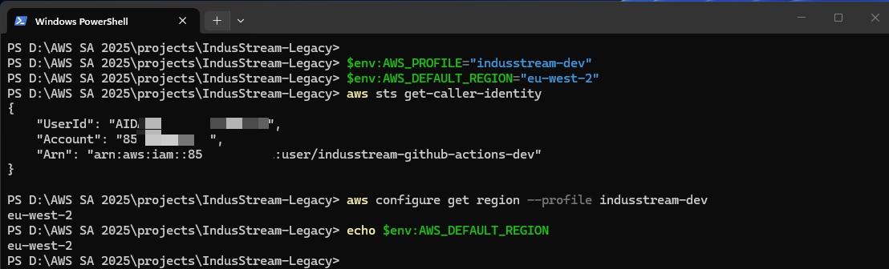

# 01-environment-validation.md

# Environment Validation

The validation process began by confirming the active AWS account, region and CLI profile configuration.

During testing, an initial mismatch was identified between the AWS Console account and the AWS CLI profile being used locally. This highlighted the importance of explicit environment isolation and profile management when working across multiple AWS environments.

The following checks were completed:

- AWS CLI profile verification
- AWS STS identity validation
- Region verification
- IAM permission troubleshooting

## Screenshots

### AWS CLI Identity Validation

### IAM Permission Validation

