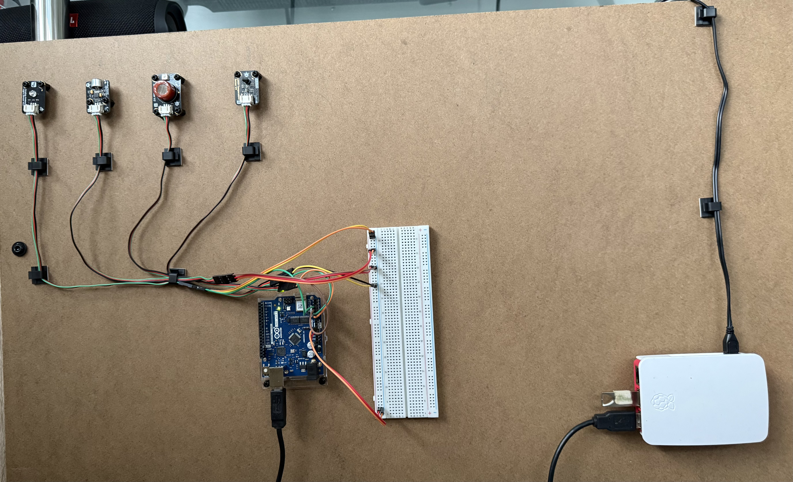

# v4 — CI/CD Automation & Deployment Engineering

This version moves IndusStream from a working edge-to-cloud telemetry pipeline into a more automated platform.

The focus of v4 is CI/CD, telemetry data quality, automated deployment, and improved operational reliability.

---

## Physical Edge Prototype

The automated platform builds on the mounted edge prototype, where sensors are connected through Arduino and processed by a Raspberry Pi edge gateway before deployment, validation, and cloud integration workflows are automated.

## Objectives

- Automate Lambda deployment using GitHub Actions
- Improve telemetry validation and anomaly filtering
- Reduce manual deployment steps
- Prepare the platform for repeatable infrastructure changes
- Improve observability and failure visibility

---

## Key Additions

- CI/CD pipeline for Lambda deployment
- Cleaner analytics data before writing to S3
- Sensor anomaly filtering
- Improved deployment documentation
- Foundation for future Infrastructure as Code

---

## Planned Documentation

- [CI/CD and Automation](docs/01-ci-cd-and-automation.md)
- [Telemetry Data Quality](docs/02-telemetry-data-quality.md)
- [Operational Refresh Workflow](docs/03-operational-refresh-workflow.md)